# SwiftUI Journey

Exploring SwiftUI through a variety of learning resources.
- [Part I: 100 Days of SwiftUI](#part-i-100-days-of-swiftui)
- [Part II](#part-ii)

## Part I 100 Days of SwiftUI
<table>

  <thead>
    <tr>
      <th>#</th>
      <th>Project</th>
      <th>Content</th>
      <th width="30%">Demo</th>
    </tr>
  </thead>

  <tbody>
    <tr>
      <td>01</td>
      <td>WeSplit</td>
      <td>
        Form, NavigationStack, @State, Picker
      </td>
      <td>
        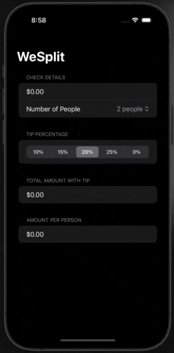
      </td>
    </tr>
    <tr>
      <td>02</td>
      <td>Snackify</td>
      <td>
        Turn your steps into snacks.
      </td>
      <td>
        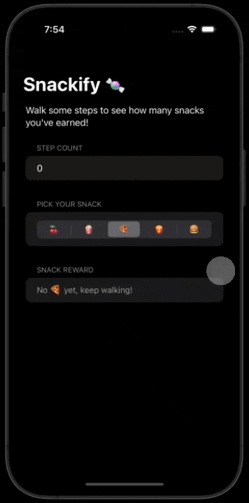
      </td>
    </tr>
    <tr>
      <td>03</td>
      <td>GuessTheFlag</td>
      <td>
        VStack, Image, LinearGradient, Buttons, Alert
      </td>
      <td>
        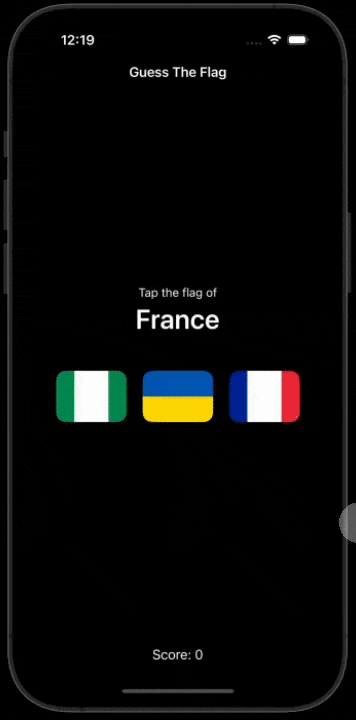
      </td>
    </tr>
    <tr>
      <td>04</td>
      <td>BetterRest</td>
      <td>
        Stepper, DatePicker, DateFormatter, Core ML
      </td>
      <td>
        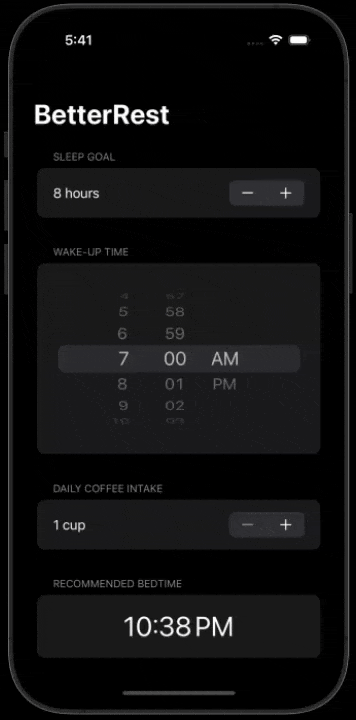
      </td>
    </tr>
    <tr>
      <td>05</td>
      <td>Animations</td>
      <td>
        Implicit animations, explicit animations, binding animations
      </td>
      <td>
        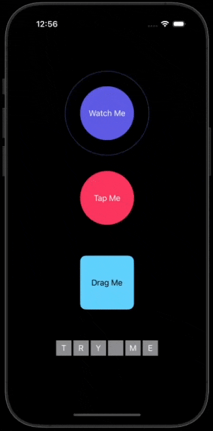
      </td>
    </tr>
    <tr>
      <td>06</td>
      <td>iExpense</td>
      <td>
        @Observable, sheet(), onDelete(), Codable, UserDefaults
      </td>
      <td>
        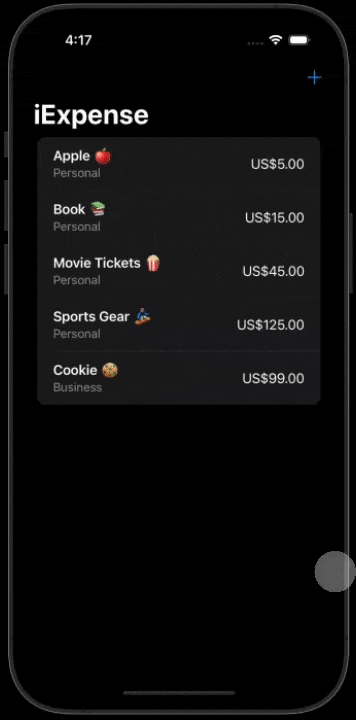
      </td>
    </tr>
    <tr>
      <td>07</td>
      <td>LayoutAndGeometry</td>
      <td>
        Layout, alignment, custom guides, GeometryReader
      </td>
      <td>
        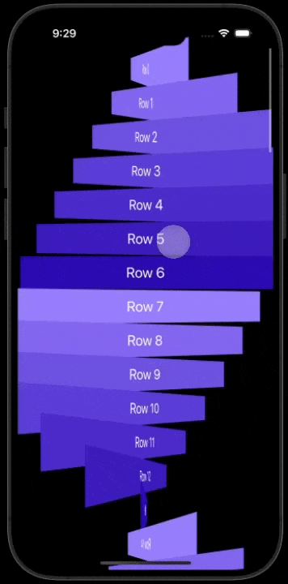
      </td>
    </tr>
    <tr>
      <td>08</td>
      <td>Drawing</td>
      <td>
        Paths, Shapes, Insettable Shapes, CGAffineTransform
      </td>
      <td>
        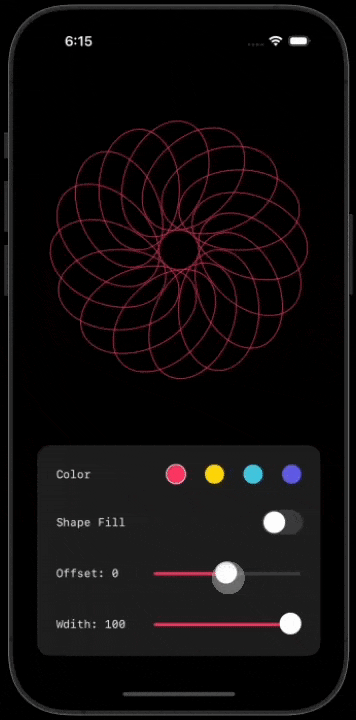
      </td>
    </tr>
  </tbody>
</table>

## Part II
<table>

  <thead>
    <tr>
      <th>#</th>
      <th>Project</th>
      <th>Content</th>
      <th width="30%">Demo</th>
    </tr>
  </thead>

  <tbody>
    <tr>
      <td>09</td>
      <td>BreathingApp</td>
      <td>
        scaleEffect, rotationEffect, offset, animation, LinearGradient
      </td>
      <td>
        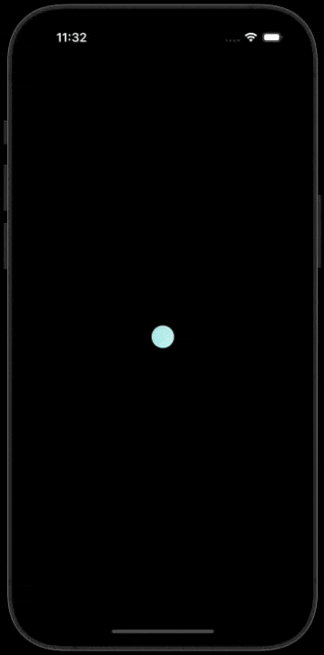
      </td>
    </tr>
    <tr>
      <td>10</td>
      <td>HolographicCard</td>
      <td>
        rotation3DEffect, DragGesture, mask, withAnimation
      </td>
      <td>
        
      </td>
    </tr>
    <tr>
      <td>11</td>
      <td>Glow Text</td>
      <td>
        rotationEffect, LinearGradient, mast, onAppear, animatoin
      </td>
      <td>
        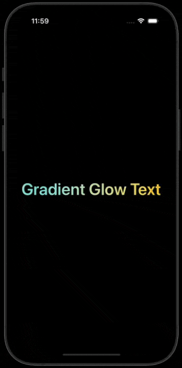
      </td>
    </tr>
    <tr>
      <td>12</td>
      <td>ScrollMinuteSlider</td>
      <td>
        DragGesture, withAnimation
      </td>
      <td>
        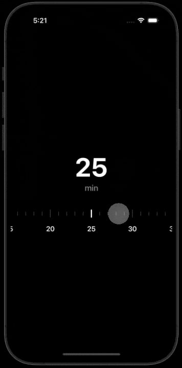
      </td>
    </tr>
  </tbody>
</table>